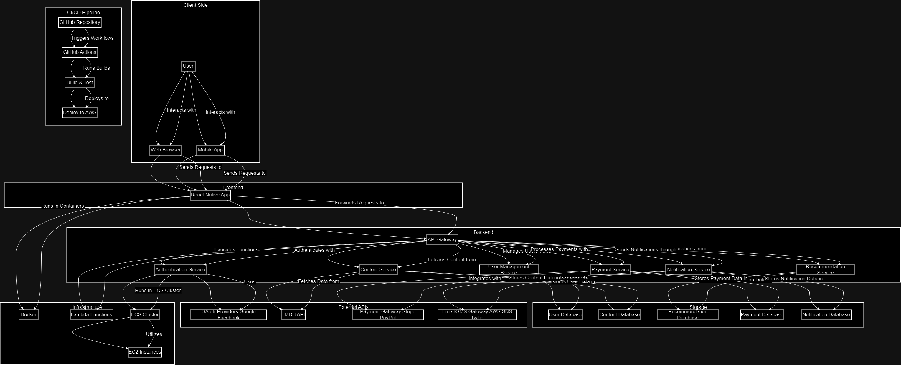
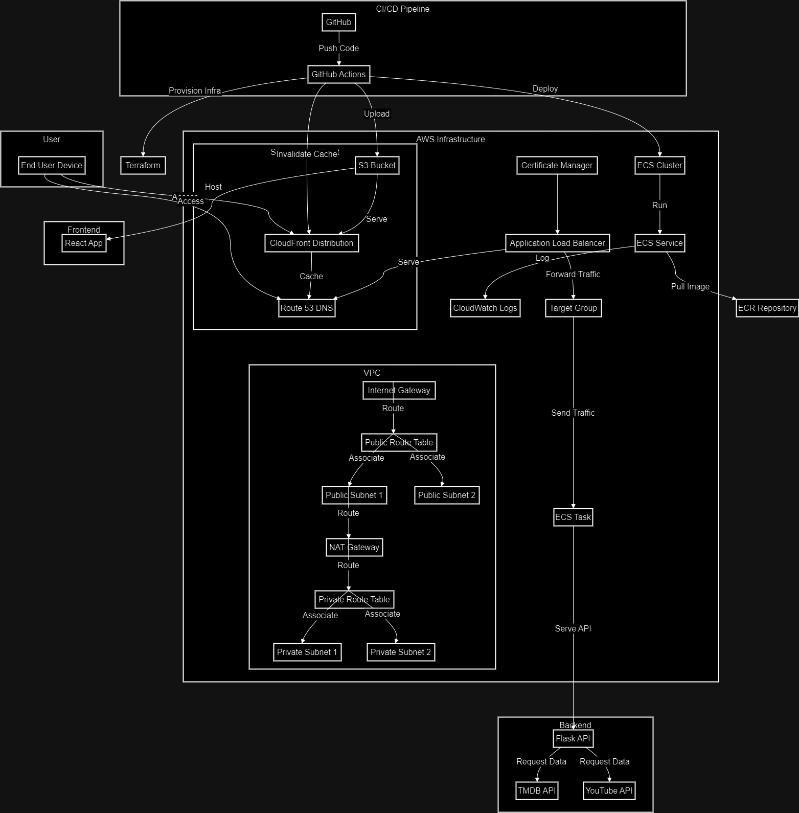

# Our Capstone Project... Group.. 3...

Number associated with harmony, wisdom and understanding

## Cast Members

1. Nor Shukri
2. Muhammad Tarmizi
3. Hnin Wut Yee
4. Mohamed Malik

## Netflix Clone.. Like...

Welcome to the **"Notflix"** Clone Project, where we pretend to be Netflix but with a lot more **AWS** wizardry and a sprinkle of humor!

Our mission? To create a **Notflix** clone using a whole arsenal of **AWS** goodies like ECR, ECS, S3, and CloudFront. We’re also throwing in **Docke** and **Terraform** because why not? The backend is powered by **Flask** and the **TMDB API**, while the frontend is all about that **React** magic.

But wait, there's more! We've set up a super slick **CI/CD** pipeline using **GitHub Actions** to make sure our deployment process is smoother than a freshly buttered popcorn. So sit back, relax, and get ready to binge-watch our progress (and hopefully not our mistakes) as we bring this clone to life!

or

The project aims to develop a Netflix clone using various AWS resources (AWS Parameter Store, ECR, ECS, and S3), Docker, Terraform, API Gateway . The application includes both backend and frontend components. The backend is built with Flask and the TMDB API, while the frontend is built with React. The project involves setting up a CI/CD pipeline to automate the deployment process.

## Our role play... Dont judge us... Though we dont live up to it...
1. Nor Shukri - (Project Manager and DevOps Lead) - Salary ****
2. Muhammad Tarmizi - (Frontend Developer) - Salary ****
3. Hnin Wut Yee - (Full Stack Developer) - Salary ****
4. Mohamed Malik - (Backend Developer) - Salary ****

## What we think we should do...
###(Project Manager and DevOps Lead):
1. Oversee the project and ensure milestones are met.
2. Set up and manage the CI/CD pipeline.
3. Configure and manage AWS resources.
4. Implement Terraform scripts for infrastructure as code.
5. Monitor project progress and handle any roadblocks.

###(Backend Developer):
1. Develop and maintain the Flask backend.
2. Integrate TMDB API with the backend.
3. Implement user authentication and authorization.
4. Write unit tests for the backend.
5. Ensure API security and performance optimization.

###(Frontend Developer):
1. Develop and maintain the React frontend.
2. Integrate frontend with the backend API.
3. Ensure responsive design and user-friendly interface.
4. Write unit tests for the frontend.
5. Handle UI/UX improvements based on feedback.

###(Full Stack Developer):
1. Assist with both backend and frontend development.
2. Ensure smooth integration between frontend and backend.
3. Write integration tests and conduct end-to-end testing.
4. Assist with deployment and troubleshooting.
5. Implement additional features and enhancements.

Idea is there... but we dont fulfil all.. hope you understand..

## How would we want it to be...

## The Reality...

## What do we use...
1. **GitHub**: The source code repository where the code for the application resides.
2. **GitHub Actions**: The CI/CD pipeline tool used to automate the build, test, and deployment processes.
3. **AWS VPC**: The virtual network within AWS that hosts all the AWS resources.
4. **Internet Gateway (IGW)**: Enables internet access for resources within the VPC.
5. **Public Route Table (RT)**: Manages the routing for the public subnets within the VPC.
6. **Public Subnets**: Subnets with direct access to the internet.
7. **Private Route Table (PrivateRT)**: Manages the routing for the private subnets within the VPC.
8. **Private Subnets**: Subnets without direct internet access, using a NAT gateway for outbound connections.
9. **NAT Gateway**: Provides internet access for resources in the private subnets.
10. **Application Load Balancer (ALB)**: Distributes incoming application traffic across multiple targets (ECS tasks). Uses SSL certificates from ACM.
11. **Target Group (TG)**: A group of ECS tasks registered with the ALB to receive traffic.
12. **Route 53**: DNS service to route traffic to the ALB and CloudFront distribution.
13. **ECR**: Amazon Elastic Container Registry to store Docker images.
14. **ECS Cluster**: Amazon Elastic Container Service cluster to manage Docker containers.
15. **ECS Service**: Manages the running of ECS tasks.
16. **ECS Task**: The Docker container running the Flask API.
17. **CloudWatch Logs**: Monitors and logs the ECS task activities.
18. **S3 Bucket**: Stores the static files for the React frontend application.
19. **CloudFront Distribution**: Caches and serves the frontend application content from S3.
20. **Flask API**: The backend application built with Flask.
21. **TMDB API**: External API used by the backend to fetch movie data.
22. **YouTube API**: External API used by the backend to fetch YouTube data.
23. **React App**: The frontend application built with React.
24. **Terraform**: Infrastructure as Code tool used to provision and manage AWS resources.
25. **ACM**: AWS Certificate Manager used to manage SSL/TLS certificates for securing traffic.
26. **End User Device**: The device used by the end user to access the application.

## GitHub Branching Strategies

## Show-and-tell Time...
1. CICD Backend - Malik and Wutyee
2. CICD Frontend - Tarmizi and Wutyee
3. End Product - Anyone

## Epic Battles

## Wised-Up Moments

## Get-Your-Geek-On Guide

## Nuke-It-From-Orbit Instructions

