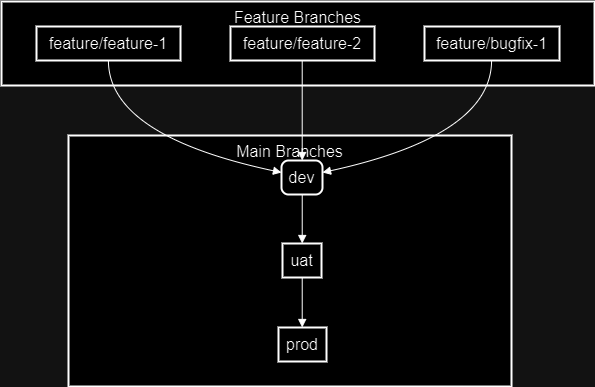

# Our Capstone Project... Group.. 3...

Number associated with harmony, wisdom and understanding

## Cast Members

1. Nor Shukri
2. Muhammad Tarmizi
3. Hnin Wut Yee
4. Mohamed Malik

## Netflix Clone.. Like...

Welcome to the **"Notflix"** Clone Project, where we pretend to be Netflix but with a lot more **AWS** wizardry and a sprinkle of humor!

Our mission? To create a **Notflix** clone using a whole arsenal of **AWS** goodies like ECR, ECS, S3, and CloudFront. We’re also throwing in **Docke** and **Terraform** because why not? The backend is powered by **Flask** and the **TMDB API**, while the frontend is all about that **React** magic.

But wait, there's more! We've set up a super slick **CI/CD** pipeline using **GitHub Actions** to make sure our deployment process is smoother than a freshly buttered popcorn. So sit back, relax, and get ready to binge-watch our progress (and hopefully not our mistakes) as we bring this clone to life!

or

The project aims to develop a Netflix clone using various AWS resources (AWS Parameter Store, ECR, ECS, and S3), Docker, Terraform, API Gateway . The application includes both backend and frontend components. The backend is built with Flask and the TMDB API, while the frontend is built with React. The project involves setting up a CI/CD pipeline to automate the deployment process.

## Our role play... Dont judge us... Though we dont live up to it...
1. Nor Shukri - (Project Manager and DevOps Lead) - Salary ****
2. Muhammad Tarmizi - (Frontend Developer) - Salary ****
3. Hnin Wut Yee - (Full Stack Developer) - Salary ****
4. Mohamed Malik - (Backend Developer) - Salary ****

## What we think we should do...
| **Role**                      | **Responsibilities**                                                                                                                                                                                                                                              |
|-------------------------------|------------------------------------------------------------------------------------------------------------------------------------------------------------------------------------------------------------------------------------------------------------------|
| **Project Manager and DevOps Wizard** | - Oversee the project and keep everyone in line (herding cats, basically).   - Set up and manage the magical CI/CD pipeline.   - Tame and configure the wild AWS resources.   - Cast Terraform spells for infrastructure as code.   - Monitor project progress and fix roadblocks (aka monster slaying). |
| **Backend Sorcerer**         | - Conjure and maintain the Flask backend.   - Integrate the mystical TMDB API with the backend.   - Implement user authentication and authorization (keeping out trolls).   - Write unit tests for the backend (making sure the spells work).   - Ensure API security and performance optimization (no goblins allowed). |
| **Frontend Wizard**        | - Develop and maintain the React frontend (making it look pretty).   - Integrate frontend with the backend API (abracadabra!).   - Ensure responsive design and user-friendly interface (fits all magical devices).   - Write unit tests for the frontend.   - Handle UI/UX improvements based on feedback (because wizards listen). |
| **Full Stack Jester**      | - Assist with both backend and frontend development (jack of all trades).   - Ensure smooth integration between frontend and backend (like peanut butter and jelly).   - Write integration tests and conduct end-to-end testing (dotting i’s and crossing t’s).   - Assist with deployment and troubleshooting (no jesting around).   - Implement additional features and enhancements (because why not?). |

Idea is there... but LIFE IS HARD.. hope you understand..

## How would we want it to be...

## The Reality...

## What do we use...

**Frontend Resources:**
1. **React App**: The frontend application built with React.
2. **S3 Bucket**: Stores the static files for the React frontend application.
3. **CloudFront Distribution**: Caches and serves the frontend application content from S3.
4. **Route 53**: DNS service to route traffic to the CloudFront distribution.

**Backend Resources:**
1. **Flask API**: The backend application built with Flask.
2. **TMDB API**: External API used by the backend to fetch movie data.
3. **YouTube API**: External API used by the backend to fetch YouTube data.
4. **ECR**: Amazon Elastic Container Registry to store Docker images.
5. **ECS Cluster**: Amazon Elastic Container Service cluster to manage Docker containers.
6. **ECS Service**: Manages the running of ECS tasks.
7. **ECS Task**: The Docker container running the Flask API.
8. **Application Load Balancer (ALB)**: Distributes incoming application traffic across multiple targets (ECS tasks). Uses SSL certificates from ACM.
9. **Target Group (TG)**: A group of ECS tasks registered with the ALB to receive traffic.
10. **CloudWatch Logs**: Monitors and logs the ECS task activities.
11. **ACM**: AWS Certificate Manager used to manage SSL/TLS certificates for securing traffic.
12. **Route 53**: DNS service to route traffic to the ALB.

**Common Resources:**
1. **GitHub**: The source code repository where the code for the application resides.
2. **GitHub Actions**: The CI/CD pipeline tool used to automate the build, test, and deployment processes.
3. **Terraform**: Infrastructure as Code tool used to provision and manage AWS resources.
4. **AWS VPC**: The virtual network within AWS that hosts all the AWS resources.
5. **Internet Gateway (IGW)**: Enables internet access for resources within the VPC.
6. **Public Route Table (RT)**: Manages the routing for the public subnets within the VPC.
7. **Public Subnets**: Subnets with direct access to the internet.
8. **Private Route Table (PrivateRT)**: Manages the routing for the private subnets within the VPC.
9. **Private Subnets**: Subnets without direct internet access, using a NAT gateway for outbound connections.
10. **NAT Gateway**: Provides internet access for resources in the private subnets.

**End User Device:**
1. **End User Device**: The device used by the end user to access the application.

or

**Frontend Resources:**
1. **React App**: The snazzy front end of our Netflix clone, where all the binge-watching magic begins.
2. **S3 Bucket**: The trusty storage locker where we keep all our shiny React app files.
3. **CloudFront Distribution**: The speedy delivery guy that ensures our React app reaches you faster than you can say ""buffering.""
4. **Route 53**: The all-knowing GPS that directs traffic to our CloudFront delivery guy.

**Backend Resources:**
1. **Flask API**: The brainiac behind the scenes, built with Flask, serving up movie data like a pro.
2. **TMDB API**: Our secret stash for all things movies, providing the data that powers our app.
3. **YouTube API**: The YouTube guru that fetches all the trending trailers and clips.
4. **ECR**: The Docker image vault, where we store all our backend goodies.
5. **ECS Cluster**: The container playground where our backend runs wild.
6. **ECS Service**: The babysitter that makes sure our backend containers are always up and running.
7. **ECS Task**: The busy little worker bees, running our Flask API inside their Docker containers.
8. **Application Load Balancer (ALB)**: The traffic cop that directs incoming requests to the right backend workers. Now with shiny SSL certificates from ACM!
9. **Target Group (TG)**: The exclusive club of backend workers, ready to serve you.
10. **CloudWatch Logs**: The gossip column that keeps track of all the backend shenanigans.
11. **ACM**: The bouncer that manages our SSL/TLS certificates, ensuring only secure traffic gets in.
12. **Route 53**: The wise old wizard that directs traffic to our ALB.

**Common Resources:**
1. **GitHub**: Our code hangout spot, where all the cool commits happen.
2. **GitHub Actions**: The automation wizard that builds, tests, and deploys our app while we kick back and relax.
3. **Terraform**: The magic wand that provisions and manages our AWS resources with a flick of the wrist.
4. **AWS VPC**: The virtual fortress where all our AWS resources live.
5. **Internet Gateway (IGW)**: The gateway to the internet wonderland for our VPC.
6. **Public Route Table (RT)**: The highway patrol for our public subnets.
7. **Public Subnets**: The bustling city blocks with direct access to the internet.
8. **Private Route Table (PrivateRT)**: The secret passageways for our private subnets.
9. **Private Subnets**: The cozy hideaways without direct internet access, using a NAT gateway for their online needs.
10. **NAT Gateway**: The secret agent providing internet access for our private subnet dwellers.

**End User Device:**
1. **End User Device**: Your favorite gadget, ready to stream endless hours of entertainment from our Netflix clone.

## GitHub Branching Strategies

We employ a structured branching strategy to manage development and deployment efficiently:

1. **Main Branches**:
    - **prod**: Contains the production-ready code. Only thoroughly tested and stable code is merged here.
    - **uat**: Used for final pre-production testing. Code from the `dev` branch is merged here for User Acceptance Testing.
    - **dev**: Main development branch. Stable code that has passed initial tests is merged here. 

2. **Feature Branches**:
    - **feature**: Used for developing new features or bug fixes. Each new feature or bug fix has its own branch, created from the `dev` branch.

#### Branching Workflow

1. **Feature Branch**:
   - Created from `dev` to work on new features or bug fixes.
   - Naming convention: `feature/<feature-name>`.

2. **Develop and Test**:
   - Code and initial tests are done in the feature branch.

3. **Merge to dev**:
   - Once stable, feature branches are merged into `dev`.
   - CI/CD pipeline tests and deploys to the development environment.

4. **Promote to uat**:
   - After thorough testing, changes are merged into `uat`.
   - Deploys to the UAT environment for final testing.

5. **Release to prod**:
   - Upon successful UAT, changes are merged into `prod`.
   - Deploys to production.

## Show-and-tell Time...
1. CICD Backend - Malik and Wutyee
2. CICD Frontend - Tarmizi and Wutyee
3. End Product - Anyone

## Epic Battles
| **Challenge**                | **Description**                                                                                                                                                                 | **Solution**                                                                                                                                                                                                                           |
|------------------------------|---------------------------------------------------------------------------------------------------------------------------------------------------------------------------------|---------------------------------------------------------------------------------------------------------------------------------------------------------------------------------------------------------------------------------------|
| **Dockerfile Dilemmas**      | Ensuring the Docker images for both the frontend and backend were built correctly and ran seamlessly.                                                                            | Tweaking the Dockerfiles to ensure all dependencies were correctly installed and the apps ran without hiccups. This included resolving issues with mismatched dependencies and environment variables.                                  |
| **CI/CD Circus**             | Setting up the CI/CD pipelines to automate the build, test, and deployment processes.                                                                                           | Crafting robust GitHub Actions workflows that included steps for linting, testing, building Docker images, pushing to ECR, and deploying to ECS. Debugging the YAML syntax and ensuring all secrets and environment variables were correctly configured. |
| **Terraform Terrors**        | Writing Terraform scripts that correctly provisioned the AWS resources needed for both the frontend and backend.                                                                 | Iterating on the Terraform configurations to handle dependencies between resources, managing state files, and ensuring idempotency. Troubleshooting common issues like resource name conflicts and incorrect configurations.            |
| **Route 53 Riddles**         | Setting up DNS configurations to route traffic correctly to the CloudFront and ALB distributions.                                                                               | Carefully configuring Route 53 records, validating domain names, and ensuring proper SSL certificate validation with ACM. Testing and validating the DNS propagation.                                                                  |
| **ECS Enigmas**              | Ensuring the ECS tasks and services were correctly configured and communicated as expected.                                                                                     | Fine-tuning the task definitions, adjusting resource allocations, and setting up proper networking configurations. Using CloudWatch logs to monitor and debug issues with ECS tasks.                                                  |
| **Logging and Monitoring Mysteries** | Setting up logging and monitoring to track application performance and issues. | Using CloudWatch for monitoring ECS tasks, setting up alarms for critical metrics, and ensuring logs were structured and useful for debugging. |"

## Wised-Up Moments
| Lesson | Description |
| --- | --- |
| **Effective API Integration** | Importance of robust error handling and retry mechanisms when integrating with third-party APIs to manage rate limits and downtime. |
| **Infrastructure as Code (IaC)** | Using Terraform for managing AWS resources provided a deeper understanding of IaC principles and the benefits of automating infrastructure deployment. |
| **CI/CD Best Practices** | Implementing a CI/CD pipeline with GitHub Actions highlighted the importance of automation in ensuring consistent and reliable application deployments. |
| **Docker Proficiency** | Building and running Docker containers for both frontend and backend applications enhanced our skills in containerization and efficient environment management. |
| **Secrets Management** | Securely managing API keys and sensitive information taught us the best practices for using tools like GitHub Secrets and AWS Secrets Manager. |
| **Cross-Origin Resource Sharing (CORS)** | Handling CORS issues between the frontend and backend reinforced the importance of proper configuration to ensure smooth communication between different application components. |
| **DNS and SSL Configuration** | Setting up Route 53 DNS records and managing SSL certificates with ACM emphasized the critical role of DNS management and security in web applications. |
| **ECS Configuration and Monitoring** | Configuring ECS tasks and services, along with setting up CloudWatch logs, provided valuable insights into the operational aspects of running containerized applications in AWS. |
| **State Management in React** | Implementing state management using React hooks and context improved our ability to maintain a consistent and responsive user interface. |
| **Team Collaboration** | Working as a team on this project highlighted the importance of clear communication, task delegation, and version control for successful collaborative development. |

## Get-Your-Geek-On Guide
 [Link text]Capstone\CE5-Group-3-Capstone\infrastructure\docs\setup-instructions.md

## Nuke-It-From-Orbit Instructions

